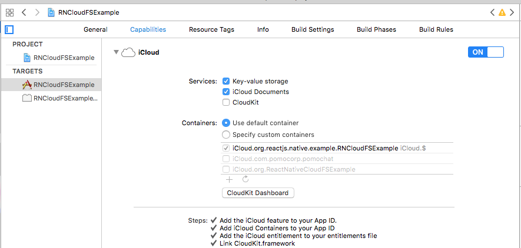

# react-native-cloud-fs

A react-native library for reading and writing files to _iCloud Drive_ (iOS) and _Google Drive_ (Android).

## Getting started

This package is not released yet and is a work in progress.  Add this to your _package.json_

`"react-native-cloud-fs": "git@github.com:npomfret/react-native-cloud-fs.git"`

And then run:

`$ react-native link react-native-cloud-fs`

### iOS

On the device, make sure iCloud Drive is enabled.

In xCode...

 * Add the following to `ios/app-name/Info.plist` (replacing _app-name_ and _package-name_ as appropriate):

```
<key>NSUbiquitousContainers</key>
<dict>
    <key>iCloud.package-name</key>
    <dict>
        <key>NSUbiquitousContainerIsDocumentScopePublic</key>
        <true/>
        <key>NSUbiquitousContainerSupportedFolderLevels</key>
        <string>One</string>
        <key>NSUbiquitousContainerName</key>
        <string>app-name</string>
    </dict>
</dict>
```

 * Enable iCloud:



### Android

Enable Google Drive API:

It's complicated! Here's a [video](https://www.youtube.com/watch?v=RezC1XP6jcs&feature=youtu.be&t=3m55s) of someone doing a similar thing for the Google Drive API demo.

  - Create a [new project](https://console.developers.google.com/apis/dashboard) for your app (if you don't already have one)
    - Under `Credentials`, choose `New Credentials` > `OAth client ID`
      - Choose `Configure consent screen`
        - enter a product name
        - save it
      - Choose `Application type` > `Android`
        - enter a name
        - enter your SHA1 fingerprint (use the keytool to find it, eg: `keytool -exportcert -alias androiddebugkey -keystore ~/.android/debug.keystore -list -v`)
        - enter your package name
        - click `create` and make a note of your OAuth client id
  - Click Library, choose `Drive API` and enable it
    - Click `Drive UI Integration`
      - add the mandatory icons
      - under `Drive integration` > `Authentication` > `Automatically show OAuth 2.0 consent screen when users open my application from Google Drive` enter your OAuth client ID   

## Usage
```javascript
import RNCloudFs from 'react-native-cloud-fs';
```

### copyToCloud
Copies the content of the `sourceUri` to a file in the cloud file system.  The files will appear in a directory named after the containing app followed by the `destinationPath`. If the target file already exists it will return an error (the target path will not get overwritten). 

```javascript
RNCloudFs.copyToCloud(sourceUri, destinationPath, mimeType)
  .then((res) => {
    console.log("it worked", res);
  })
  .catch((err) => {
    console.warn("it failed", err);
  })
```

_sourceUri_: any uri or **absolute** file path, e.g:
 * `/foo/bar/file.txt`
 * `file://foo/bar/file.txt`
 * `http://www.files.com/foo/bar/file.txt`
 * `content://media/external/images/media/296` (android only)
 * `assets-library://asset/asset.JPG?id=106E99A1-4F6A-45A2-B320-B0AD4A8E8473&ext=JPG` (iOS only)
 
_destinationPath_: a **relative** path including a filename under which the file will be placed, e.g:
 * `my-cloud-text-file.txt`
 * `foo/bar/my-cloud-text-file.txt`
 
_mimeType_:  a mime type to store the file with **or null** (android only) 
 * `text/plain`
 * `application/json`
 * `image/jpeg`
 